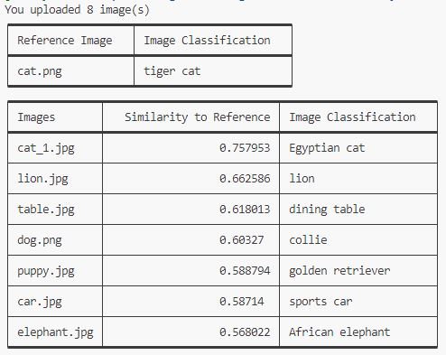

# Semantic Similarity Web API with Image Embeddings
Web API and a client application that leverages a pre-trained CNN from pytorch to generate image embeddings which are then used for semantic similarity analysis.  
The project is split into 2 components:  
1. FastAPI that takes multiple images and provide image embeddings and image classification predictinos.  
    - Image embeddings are extracted from a pretrained ResNet18 trained on ImagNet.
    - The fastAPI web service is containerized using docker.
    - The application take multiple images and returns embeddings for each image. 
    - Image classification predictions are also returned. 
2. Command line client script that computes the similarity between a reference images and a list of images.  
    - Python script takes a reference image and folder containing all other images as input.
    - Requests are sent to the FastAPI above which returns embeddings for all images including reference. 
    - Cosine similarity is used to determine similarity between images embedding vectors.
    - Top 10 closest images are returned with similarity scores and image classification results. 

## Requirements

* Python==3.10.13
* fastapi==0.78.0
* uvicorn==0.17.6
* python-multipart==0.0.5
* pillow==10.2.0
* torch==2.2.1
* torchvision==0.17.1
* tabulate==0.9.0

Or run `pip install -r requirements.txt`   

## Installation

### FastAPI Web Service
FastAPI is run on docker. To create docker image and run docker container, run the following command lines:   
> `docker build -t fastapi-image-embeddings .` (may take a few mintes)  
> `docker run -p 8080:8080 fastapi-image-embeddings` (port 8080 is exposed)   

### Image Similarity Analysis
To compute similarity against reference image, run the following command:   
> `pip install -r requirements.txt`   
> `python similarity_analysis.py`  

Last line sends request to FastAPI image embeddings service and receives a json with keys **["message", "predictions", "embeddings"]**  
"embeddings" are used for similarity analysis. 

Default parameters will be selected for analysis using test images in */images*.   
Optional parameters include:   
* images_folder : The path to the folder containing all images including reference image `default = images`  
* ref_image : The refence image name from which we compare the other images to. `default = cat.png`   

**Example**: `python similarity_analysis.py --images_folder images --ref_image cat.png`

## Example Run
From the above command lines, the output will be:  

## Applications
1. Image Search Engines
2. Content-Based Image Retrieval (CBIR)
3. Recommendation Systems
4. Duplicate Detection
5. Face Recognition and Verification
6. Medical Image Analysis

## Improvements 
- [x] Include network classification predicitons to better understand similarity measurements
- [ ] Explore other similarity metrics
- [ ] GPU support
- [ ] Alternative CNN's for improved embeddings
- [ ] Create Vector database for already seen images to improve efficiency

